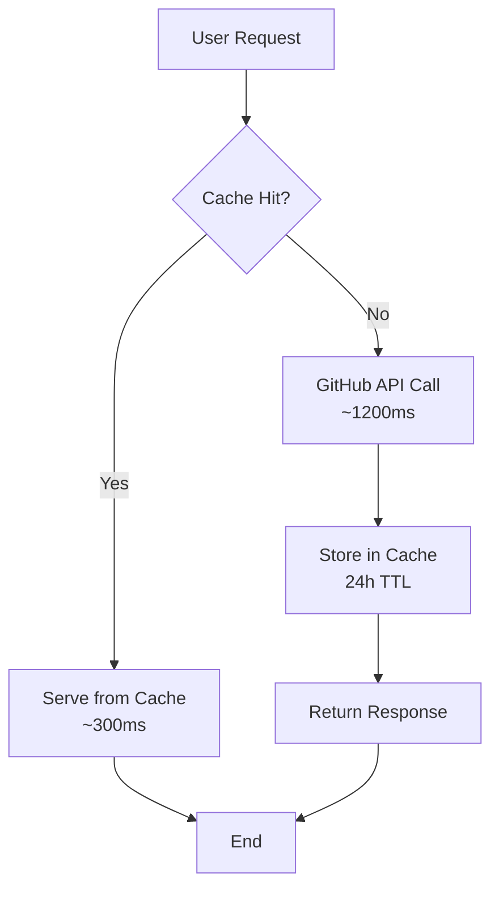

# Deepgram Starter Ecosystem 🚀

A modern, dynamic showcase for Deepgram's starter applications ecosystem. This Next.js application automatically discovers and displays starter projects from the `deepgram-starters` GitHub organization, providing developers with an intuitive way to find and deploy starter applications.

## 🎯 Overview

The Deepgram Starter Ecosystem serves as the central discovery platform for our starter applications. It dynamically fetches repository data, README content, and configuration metadata to present a comprehensive, searchable catalog of starter projects.

## 🛠 Tech Stack

| Category        | Technology                  |
|-----------------|-----------------------------|
| **Framework**   | Next.js 15.4.4 (App Router) |
| **Language**    | TypeScript                  |
| **UI Library**  | NextUI                      |
| **Styling**     | Tailwind CSS                |
| **Icons**       | Heroicons                   |
| **Animations**  | Framer Motion               |
| **Markdown**    | react-markdown + plugins    |
| **HTTP Client** | Fetch API                   |

## 🚀 Quick Start

### Prerequisites

- Node.js 18+
- npm or yarn
- GitHub Personal Access Token (recommended)

### Installation

1. **Clone the repository**:
   ```bash
   git clone <repository-url>
   cd deepgram-starter-ecosystem
   ```

2. **Install dependencies**:
   ```bash
   npm install
   ```

3. **Environment setup**:
   ```bash
   cp .env.example .env.local
   ```

   Edit `.env.local` and add your GitHub token:
   ```bash
   # Optional but recommended for higher rate limits
   GH_PAT=your_github_personal_access_token_here
   NEXT_PUBLIC_APP_URL=http://localhost:3000
   ```

4. **Start development server**:
   ```bash
   npm run dev
   ```

5. **Open your browser**: [http://localhost:3000](http://localhost:3000)

6. **Testing**
   ```bash
   npm run test
   ```

## 📁 Project Architecture

```
src/
├── app/                          # Next.js App Router
│   ├── api/
│   │   └── starters/
│   │       ├── route.ts          # Main starters API endpoint
│   │       └── [slug]/
│   │           └── readme/
│   │               └── route.ts  # Individual README API
│   ├── starters/
│   │   └── [slug]/
│   │       └── page.tsx          # Starter detail pages
│   ├── globals.css               # Global styles
│   ├── layout.tsx                # Root layout
│   ├── not-found.tsx             # 404 page
│   ├── page.tsx                  # Home page
│   └── providers.tsx             # React providers
├── components/                   # Reusable UI components
│   ├── FilterSidebar.tsx         # Filtering interface
│   ├── HeroSection.tsx           # Landing hero
│   ├── Loading.tsx               # Loading states
│   ├── SearchFilters.tsx         # Search functionality
│   └── StarterGrid.tsx           # Main grid display
├── lib/
│   └── github.ts                 # GitHub API integration
├── types/
│   └── index.ts                  # TypeScript definitions
├── public/                       # Static assets
├── test-caching.js               # Cache performance test suite
└── config files...               # Next.js, Tailwind, etc.
```

## ⚡ Caching Architecture

### Implementation Overview

The application uses a multi-layered caching strategy to minimize GitHub API usage:



### Cache Layers

1. **Next.js Data Cache**: Server-side caching with `next: { revalidate: 86400 }`
2. **HTTP Cache Headers**: Browser/CDN caching with `Cache-Control`
3. **ISR (Incremental Static Regeneration)**: Background cache updates

### Key Files

- `src/lib/github.ts`: GitHub API calls with cache configuration
- `src/app/api/starters/route.ts`: Main API with ISR settings
- `src/app/api/starters/[slug]/readme/route.ts`: README API with caching
- `test-caching.js`: Performance testing suite

### Cache Invalidation

```bash
# Manual cache clear (if needed)
rm -rf .next/cache

# Test cache performance
npm run test:cache

# Monitor cache in development
# Check console logs for cache hits/misses
```

## 🔌 API Reference

### Endpoints

#### `GET /api/starters`
Fetches all starter repositories with processed metadata.

**Response**:
```typescript
ProcessedStarter[] = {
  id: number;
  name: string;
  title: string;
  description: string;
  language: string;
  framework?: string;
  category?: string;
  links: {
    github: string;
    docs?: string;
    demo?: string;
  };
  stats: {
    stars: number;
    forks: number;
    lastUpdated: string;
  };
  config?: TomlConfig;
}
```

**Caching**: 24 hours (86400s) with 48-hour stale-while-revalidate

#### `GET /api/starters/[slug]/readme`
Fetches README content for a specific starter.

**Response**:
```typescript
{
  content: string;    // Base64 encoded content
  encoding: string;   // Usually "base64"
}
```

**Caching**: 24 hours (86400s) with 48-hour stale-while-revalidate

## 🔧 Configuration System

### TOML Configuration

Each starter repository can include a `deepgram.toml` file for metadata:

```toml
[meta]
title = "Voice Agent TypeScript"
description = "Real-time voice agent with WebSocket support"
author = "Deepgram"
language = "TypeScript"
framework = "Next.js"
useCase = "Voice Agent"

[build]
command = "npm install && npm run build"

[requirements]
node = "18+"
dependencies = ["@deepgram/sdk"]

[config]
sample = ".env.example"
output = ".env.local"

[post-build]
message = "Remember to add your Deepgram API key to .env.local"

[links]
docs = "https://docs.deepgram.com"
demo = "https://demo.example.com"

[deployment]
platforms = ["Vercel", "Netlify"]
requirements = ["Node.js 18+", "Deepgram API Key"]
```

### Data Flow

1. **Repository Discovery**: Fetches repos from `deepgram-starters` org
2. **Configuration Loading**: Reads `deepgram.toml` from each repo
3. **Data Processing**: Transforms raw data into UI-friendly format
4. **Caching**: Stores processed data with appropriate cache headers
5. **UI Rendering**: Displays data with filtering and search

## 🎨 UI Components

### Component Hierarchy

```
App
├── HeroSection
├── SearchFilters
├── FilterSidebar
└── StarterGrid
    └── StarterCard[]

StarterDetailPage
├── Sidebar
│   ├── BackButton
│   ├── StarterInfo
│   ├── ActionButtons
│   └── ConfigurationDisplay
└── MainContent
    └── MarkdownRenderer
```

### Styling Guidelines

- **Dark Theme**: Black backgrounds with gradient accents
- **Gradient Borders**:
- **Typography**: Clean, readable hierarchy
- **Interactive Elements**: Hover states and smooth transitions
- **Responsive**: Mobile-first approach

## 🔍 GitHub Integration

### Authentication

The app uses GitHub's REST API v3. Authentication is optional but recommended:

- **Without token**: 60 requests/hour
- **With token**: 5,000 requests/hour

### GitHub API Caching & Rate Limiting

The application implements aggressive caching to minimize GitHub API usage and prevent rate limiting issues:

#### **Caching Strategy**
- **24-hour cache duration**: All GitHub API responses cached for 24 hours
- **Stale-while-revalidate**: Serves stale content for up to 48 hours if GitHub is unavailable
- **Next.js ISR**: Uses Incremental Static Regeneration for optimal performance
- **~99% API reduction**: Dramatically reduces GitHub API calls after initial load

#### **Cache Configuration**
```typescript
// API Routes
export const revalidate = 86400; // 24 hours

// HTTP Headers
Cache-Control: public, s-maxage=86400, stale-while-revalidate=172800
```

#### **Rate Limiting Protection**
- **Without token**: 60 requests/hour → Effectively unlimited with caching
- **With token**: 5,000 requests/hour → Zero risk of hitting limits
- **Error handling**: Graceful fallbacks to mock data if API fails
- **Automatic retry**: Built-in error recovery mechanisms

#### **Content Updates**
- **Repository changes**: Reflected within 24 hours (automatic)
- **README updates**: Reflected within 24 hours (automatic)
- **Force refresh**: Cache can be invalidated manually if needed

#### **Performance Benefits**
- **First visit**: ~1.2s (GitHub API calls)
- **Cached visits**: ~0.3s (served from cache)
- **72-92% faster**: Significant performance improvement after caching

## 🐛 Troubleshooting

### Common Issues

**API 404 Errors**:
```bash
# Check if GitHub API is accessible
curl -I https://api.github.com/orgs/deepgram-starters/repos

# Verify environment variables
echo $GH_PAT
```

**Build Failures**:
```bash
# Clear Next.js cache
rm -rf .next
npm run build
```

**Styling Issues**:
```bash
# Regenerate Tailwind classes
npm run build:css
```

**Cache Issues**:
```bash
# Clear Next.js cache
rm -rf .next/cache

# Verify cache headers
curl -I http://localhost:3000/api/starters

# Check for stale data
# Look for "Cache: public, s-maxage=86400" in response headers
```

### Debug Mode

Enable verbose logging by setting:
```bash
NODE_ENV=development
```

## 🚀 Deployment

### Environment Variables (Production)

```bash
GH_PAT=github_pat_xxxxx                    # GitHub token
NEXT_PUBLIC_APP_URL=https://yourapp.com    # Production URL
```

### Vercel Deployment

1. **Connect GitHub**: Link your repository
2. **Set environment variables**: Add `GH_PAT` in Vercel dashboard
3. **Deploy**: Automatic deployments on push to main

### Deployment

```bash
# Build for production
npm run build

# Start production server and validate build
npm run start

# The site is currently deployed to the Deepgram Fly.io Account
fly deploy
```


## 🔒 Security

### Best Practices

- **Environment variables**: Never commit secrets
- **API tokens**: Use minimal required scopes
- **Dependencies**: Keep packages updated
- **CSP**: Content Security Policy headers

### GitHub Token Scopes

> Token is already set as a secret in Fly.io

Required scopes for `GH_PAT`:
- `public_repo`: Read public repository data
- No additional scopes needed

---

## 👥 Team

**Maintainers**: Deepgram Developer Experience Team


